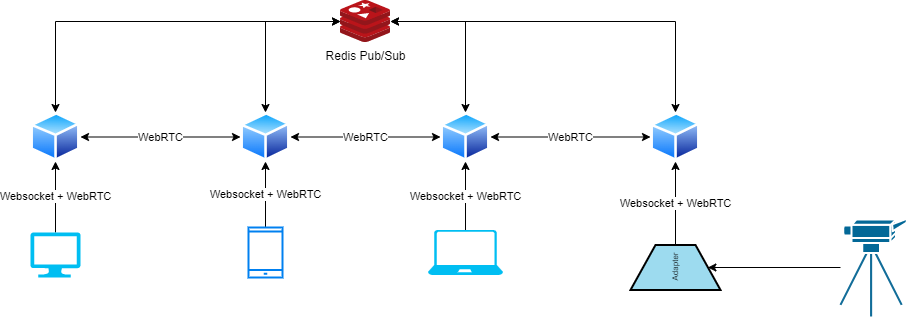

# WebRTC CDN

Live media content delivery network based on the WebRTC protocol.

## Compilation

In order to install dependencies, type:

```
go get github.com/AgustinSRG/webrtc-cdn
```

To compile the code type:

```
go build
```

The build command will create a binary in the currenct directory, called `webrtc-cdn`, or `webrtc-cdn.exe` if you are using Windows.

## Docker Image

You can find the docker image for this project available in Docker Hub: [https://hub.docker.com/r/asanrom/webrtc-cdn](https://hub.docker.com/r/asanrom/webrtc-cdn)

To pull it type:

```
docker pull asanrom/webrtc-cdn
```

## Usage

This project is meant to be used to create a network to deliver live media content using the WebRTC protocol.

In order to create the network, you can spawn multiple nodes connected to a Redis Pub/Sub service for inter-node communication.

Once the network is up, clients can connect to the nodes via Websocket (for signaling purposes), in order to request for publishing or receiving media streams via WebRTC.



## Configuration

You can configure the node using environment variables

### WebRTC options

| Variable Name | Description |
|---|---|
| STUN_SERVER | STUN server URL. Example: `stun:stun.l.google.com:19302` |
| TURN_SERVER | TURN server URL. Set if the server is behind NAT. Example: `turn:turn.example.com:3478` |
| TURN_USERNAME | Username for the TURN server. |
| TURN_PASSWORD | Credential for the TURN server. |

### Redis

To configure the redis connection, set the following variables:

| Variable Name | Description |
|---|---|
| REDIS_PORT | Port to connect to Redis Pub/Sub. Default is `6379` |
| REDIS_HOST | Host to connect to Redis Pub/Sub. Default is `127.0.0.1` |
| REDIS_PASSWORD | Redis authentication password, if required. |
| REDIS_TLS | Set it to `YES` in order to use TLS for the connection. |

### TLS

If you want to use TLS (recommended), you have to set 3 variables in order for it to work:

| Variable Name | Description |
|---|---|
| SSL_PORT | RTMPS (RTMP over TLS) listening port. Default is `443` |
| SSL_CERT | Path to SSL certificate. |
| SSL_KEY | Path to SSL private key. |

### Authentication

Authentication options:

| Variable Name | Description |
|---|---|
| JWT_SECRET | Secret to validate JSON web tokens used for authentication in the signaling protocol. If not set, no authentication is required. |

### More options

Here is a list with more options you can configure:

| Variable Name | Description |
|---|---|
| HTTP_PORT | HTTP listening port for insecure websocket connections. Default is `80` |
| BIND_ADDRESS | Bind address for siganling services. By default it binds to all network interfaces. |
| LOG_REQUESTS | Set to `YES` or `NO`. By default is `YES` |
| LOG_DEBUG | Set to `YES` or `NO`. By default is `NO` |
| MAX_IP_CONCURRENT_CONNECTIONS | Max number of concurrent connections to accept from a single IP. By default is 4. |
| CONCURRENT_LIMIT_WHITELIST | List of IP ranges not affected by the max number of concurrent connections limit. Split by commas. Example: `127.0.0.1,10.0.0.0/8` |
| MAX_REQUESTS_PER_SOCKET | Max number of active requests for a single websocket session. By default is `100` |

## Firewall configuration

The ports used by the signaling websocket server must be openned, they are `80` and `443` by default.

In order for the nodes to be able to communicate via WebRTC, they need to use the port range `40000:65535/UDP`

If you use a TURN server there is no need for the UDP ports to be oppened, since communication can be acomplish using the TURN server as intermediate.

## Documentation

Check the documentation in order to connect to the nodes:

 - [Signaling protocol](./doc/signaling.md)

If you want to know about the inter-node communication protocol check:

 - [Inter-Node communication protocol](./doc/redis.md)
